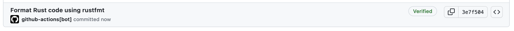
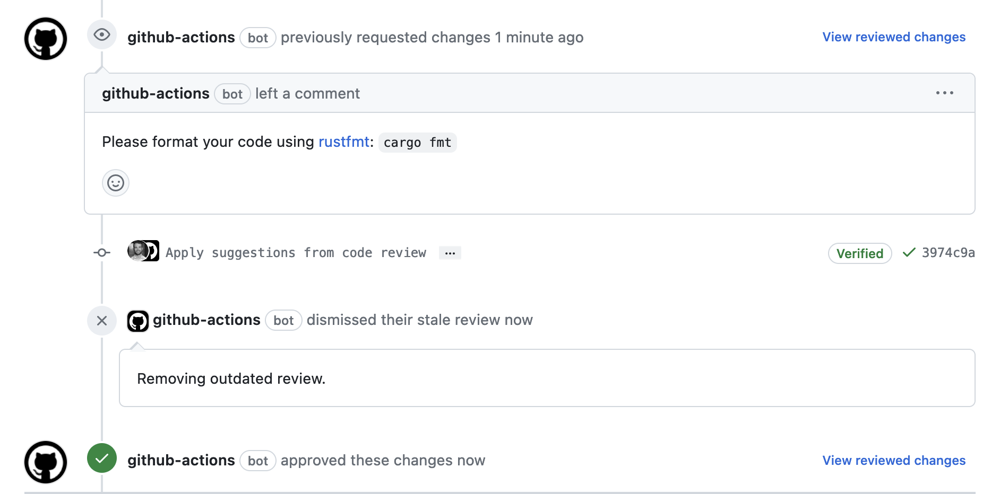
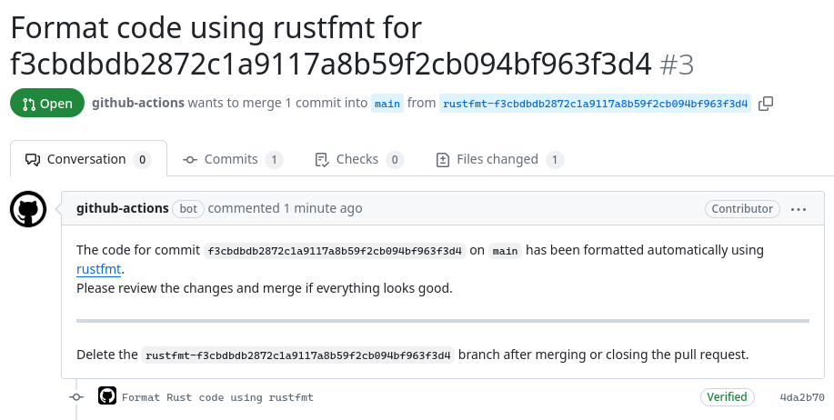

# rustfmt-check

GitHub Action to format [Rust] code using [rustfmt].

This action can be used to keep [Rust] code formatted correctly.

## Modes

This action supports three different modes. The `commit` mode is the default mode.

### Commit

A commit is pushed when formatting is required.

#### Example

```
on: push

name: Rustfmt

jobs:
  format:
    runs-on: ubuntu-latest
    steps:
      - uses: actions/checkout@v4
      - uses: dtolnay/rust-toolchain@stable
        with:
          components: rustfmt
      - uses: mbrobbel/rustfmt-check@master
        with:
          token: ${{ secrets.GITHUB_TOKEN }}
```



### Review

The action reviews the PR, either requesting formatting changes, or approving if no formatting is required.

#### Example

```
on: pull_request

name: Rustfmt

jobs:
  format:
    runs-on: ubuntu-latest
    permissions:
      pull-requests: write
    steps:
      - uses: actions/checkout@v4
      - uses: dtolnay/rust-toolchain@nightly
        with:
          components: rustfmt
      - uses: mbrobbel/rustfmt-check@master
        with:
          token: ${{ secrets.GITHUB_TOKEN }}
          mode: review
```



Please note that this mode requires:
- A nightly Rust toolchain
- [Allowing GitHub Actions to create or approve pull reqeuests](https://docs.github.com/en/repositories/managing-your-repositorys-settings-and-features/enabling-features-for-your-repository/managing-github-actions-settings-for-a-repository#preventing-github-actions-from-creating-or-approving-pull-requests).

### Pull request

The action creates a pull request with the formatting changes.

#### Example

```
on: pull_request

name: Rustfmt

jobs:
  format:
    runs-on: ubuntu-latest
    permissions: write-all
    steps:
      - uses: actions/checkout@v4
      - uses: dtolnay/rust-toolchain@stable
        with:
          components: rustfmt
      - uses: mbrobbel/rustfmt-check@master
        with:
          token: ${{ secrets.GITHUB_TOKEN }}
          mode: pull
```



Please note that this mode requires:
- [Allowing GitHub Actions to create or approve pull reqeuests](https://docs.github.com/en/repositories/managing-your-repositorys-settings-and-features/enabling-features-for-your-repository/managing-github-actions-settings-for-a-repository#preventing-github-actions-from-creating-or-approving-pull-requests).

## Arguments

See [action.yml](./action.yml).

[rust]: https://github.com/rust-lang/rust
[rustfmt]: https://github.com/rust-lang/rustfmt
